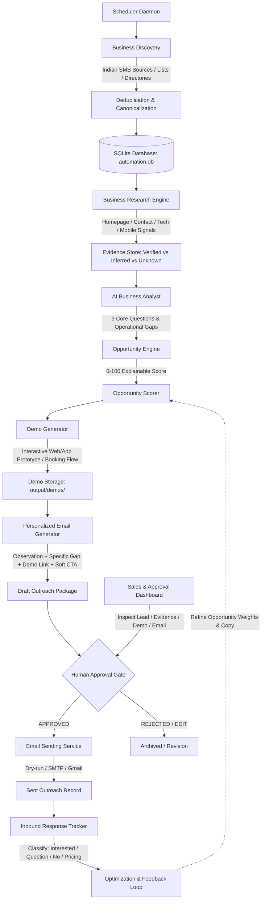

# B2B Business Outreach Automation System — Development Plan & Technical Architecture

## 1. Master Project Realignment & Product Vision

### 1.1 Core Target Product
An autonomous, safety-gated AI system that finds Indian businesses that would benefit from digital software and automation services, researches their online presence, identifies concrete operational and digital gaps, generates tailored interactive web/app prototypes, drafts personalized outreach, presents everything in an approval dashboard, safely sends outreach upon explicit approval, and tracks inbound responses.

### 1.2 End-to-End Core Workflow



---

## 2. Non-Negotiable Operational Principles

1. **Human Approval First:** No email is ever sent automatically without explicit operator review and confirmation in the dashboard.
2. **Zero Information Hallucination:** Never fabricate services, technologies, phone numbers, contact names, or customer complaints. Every claim must link to source URLs/evidence or be marked `UNKNOWN`.
3. **Concrete Business Value:** Reject generic AI phrases like "Your business could benefit from AI." Every pitch must target a specific observed friction point (e.g. manual telephone bookings for a salon, lack of property catalog for a realtor).
4. **Real Demonstrable Prototypes:** Generate tailored, interactive, mobile-first web applications or landing pages demonstrating the exact proposed solution.
5. **Safety, Privacy & Anti-Spam Compliance:** Adhere to `robots.txt`, rate limits, exponential backoff, legal privacy norms, and daily provider quotas.
6. **Full Traceability:** Preserve complete provenance from discovery source -> research evidence -> analysis -> demo -> email draft -> approval -> send event -> response.

---

## 3. Architecture Audit & Component Reusability Matrix

| Component | Status | Reusability in B2B Outreach System |
|---|---|---|
| **`src/db/`** (SQLite Engine) | **Reused & Extended** | WAL mode, parameterized transactions, schema migrations, and indexing extend to store `BusinessLead`, `ResearchEvidence`, `Opportunity`, `Demo`, `Outreach`, `EmailEvent`, and `Response`. |
| **`src/collectors/`** (Ingestion Base) | **Reused & Adapted** | `BaseCollector` pattern adapts into `BaseDiscoveryProvider` with network timeouts, retry decorators, and User-Agent management. |
| **`src/processors/`** (Clean & Dedup) | **Reused & Adapted** | `cleaner.py` (URL canonicalization, HTML stripping) and `deduplicator.py` (token similarity, domain hashing) prevent duplicate business outreach. |
| **`src/pipeline/safeguards.py`** | **Reused & Adapted** | `PublishQuotaGuard` -> `OutreachQuotaGuard` (daily sending limits); `StoragePruningEngine` (cleans temp scrapers/renders); `SystemHealthMonitor` (disk space, API health). |
| **`src/pipeline/recovery.py`** | **Reused & Adapted** | `JobRecoveryEngine` adapts to recover interrupted research/analysis/demo generation tasks on crash/restart. |
| **`src/publishers/publisher_service.py`** | **Reused & Adapted** | Approval gatekeeper pattern (`PENDING_REVIEW` -> `APPROVED` -> `STAGED` -> `SENT`) directly enforces human-in-the-loop email safety. |
| **`src/scheduler/daemon.py`** | **Reused & Adapted** | `AutomationDaemon` loop, `SIGINT`/`SIGTERM` signal handlers, sleep slicing, and audit logging drive the daily business discovery and analysis cycles. |
| **`src/dashboard/server.py`** | **Reused & Adapted** | Pure-Python lightweight HTTP server with REST JSON API directly hosts the **Sales Approval Dashboard**, demo previews, and outreach review UI. |
| **`src/video/` & `src/voice/`** | **Legacy / Preserved** | FFmpeg video compositor, Edge-TTS, and subtitle aligners remain intact and functional for existing tests, but will receive no further feature additions. |

---

## 4. Database Schema Design (`output/automation.db`)

```sql
-- 1. Discovered Businesses
CREATE TABLE IF NOT EXISTS businesses (
    id TEXT PRIMARY KEY,
    name TEXT NOT NULL,
    category TEXT NOT NULL,          -- restaurant, salon, gym, clinic, coaching, retail, real_estate, etc.
    city TEXT NOT NULL,
    state TEXT,
    website TEXT,
    domain TEXT,
    phone TEXT,
    email TEXT,
    address TEXT,
    source_provider TEXT NOT NULL,   -- csv_import, public_directory, maps_api, web_listing
    source_id TEXT,
    status TEXT NOT NULL DEFAULT 'discovered', -- discovered, researched, analyzed, scored, demo_ready, email_ready, pending_approval, approved, sent, rejected
    created_at TEXT NOT NULL,
    updated_at TEXT NOT NULL,
    UNIQUE(name, city),
    UNIQUE(domain)
);

-- 2. Verified Research Evidence
CREATE TABLE IF NOT EXISTS research_evidence (
    id TEXT PRIMARY KEY,
    business_id TEXT NOT NULL REFERENCES businesses(id),
    category TEXT NOT NULL,          -- identity, services, tech_stack, contact_flow, booking_flow, mobile_ux
    claim TEXT NOT NULL,
    claim_type TEXT NOT NULL,        -- verified_fact, ai_inference, unknown
    evidence_url TEXT,
    raw_snippet TEXT,
    confidence REAL NOT NULL DEFAULT 1.0,
    created_at TEXT NOT NULL
);

-- 3. Business Opportunity & Analysis
CREATE TABLE IF NOT EXISTS opportunities (
    id TEXT PRIMARY KEY,
    business_id TEXT NOT NULL REFERENCES businesses(id),
    opportunity_type TEXT NOT NULL,  -- online_booking, lead_capture, website_modernization, customer_portal, ordering_system
    title TEXT NOT NULL,
    problem_summary TEXT NOT NULL,
    proposed_solution TEXT NOT NULL,
    business_value TEXT NOT NULL,
    score REAL NOT NULL,             -- 0.0 to 100.0
    score_reasons TEXT NOT NULL,     -- JSON array of positive/negative scoring factors
    risks TEXT,                      -- JSON array of unknown/uncertainty risks
    confidence REAL NOT NULL,
    status TEXT NOT NULL DEFAULT 'identified',
    created_at TEXT NOT NULL
);

-- 4. Generated Interactive Demos
CREATE TABLE IF NOT EXISTS demos (
    id TEXT PRIMARY KEY,
    opportunity_id TEXT NOT NULL REFERENCES opportunities(id),
    business_id TEXT NOT NULL REFERENCES businesses(id),
    demo_type TEXT NOT NULL,          -- booking_website, landing_page, quotation_portal, workflow_mockup
    title TEXT NOT NULL,
    preview_url TEXT,
    artifact_path TEXT NOT NULL,     -- path to output/demos/<id>/index.html
    metadata_json TEXT,
    created_at TEXT NOT NULL
);

-- 5. Outreach & Email History
CREATE TABLE IF NOT EXISTS outreach (
    id TEXT PRIMARY KEY,
    business_id TEXT NOT NULL REFERENCES businesses(id),
    opportunity_id TEXT NOT NULL REFERENCES opportunities(id),
    demo_id TEXT NOT NULL REFERENCES demos(id),
    recipient_email TEXT NOT NULL,
    subject TEXT NOT NULL,
    body_text TEXT NOT NULL,
    body_html TEXT,
    followup_body TEXT,
    personalization_reasons TEXT,
    evidence_used TEXT,
    approval_status TEXT NOT NULL DEFAULT 'pending_review', -- pending_review, approved, rejected, staged
    send_status TEXT NOT NULL DEFAULT 'draft',              -- draft, sent, failed
    sent_at TEXT,
    provider_message_id TEXT,
    last_error TEXT,
    created_at TEXT NOT NULL
);

-- 6. Inbound Responses & Follow-ups
CREATE TABLE IF NOT EXISTS outreach_responses (
    id TEXT PRIMARY KEY,
    outreach_id TEXT NOT NULL REFERENCES outreach(id),
    business_id TEXT NOT NULL REFERENCES businesses(id),
    received_at TEXT NOT NULL,
    classification TEXT NOT NULL,    -- interested, not_interested, question, wants_pricing, wants_meeting, out_of_office, unclear
    raw_content TEXT,
    suggested_reply TEXT,
    reply_status TEXT NOT NULL DEFAULT 'pending_review'
);
```

---

## 5. Agent Responsibilities

```
┌─────────────────────────────────────────────────────────────────────────────┐
│                          JIM — INFRASTRUCTURE & SYSTEMS                     │
├─────────────────────────────────────────────────────────────────────────────┤
│ 1. Core Architecture, Data Models & SQLite Schema Persistence               │
│ 2. Discovery Provider Engine (Base Provider, CSV Ingestion, Lead Dedup)     │
│ 3. Research Pipeline Infrastructure (Safe HTTP Fetching, Robots.txt, Limits)│
│ 4. Demo Hosting & Local Artifact Serving (Dashboard Web Server integration) │
│ 5. Approval Gatekeeper & Outreach Service (Strict Human-in-the-Loop)        │
│ 6. Email Provider Infrastructure (Console/Dry-Run, SMTP, Gmail API)         │
│ 7. Inbound Response Pipeline & Webhook/Polling Infrastructure               │
│ 8. Automation Daemon, Daily Scheduled Cycles, Crash Recovery, Audit Logs    │
│ 9. Dashboard Backend Endpoints & Multi-View Sales Lead Frontend             │
└─────────────────────────────────────────────────────────────────────────────┘

┌─────────────────────────────────────────────────────────────────────────────┐
│                     RYAN — AI & BUSINESS INTELLIGENCE                       │
├─────────────────────────────────────────────────────────────────────────────┤
│ 1. Research Intelligence & Signal Extraction (Contact, Services, Tech Stack)│
│ 2. AI Business Analyst Engine (9 Core Questions, Operational Gap Analysis)  │
│ 3. Transparent Opportunity Scorer (0-100 Evidence-Weighted Scoring Model)   │
│ 4. Demo Content Strategy & Responsive Template Generators (Booking, Portals)│
│ 5. Personalized Outreach Generator (Compelling, Non-Spam Copy + Evidence)   │
│ 6. Inbound Response AI Classifier & Suggested Reply Generator               │
│ 7. Outreach Optimization & Feedback Learning Layer                          │
└─────────────────────────────────────────────────────────────────────────────┘
```

---

## 6. Phased Implementation Roadmap

### Phase A: Architecture, Data Models & Persistence Foundation [COMPLETED]
- [x] **Core Models & Enums (`src/b2b/models.py`, `src/db/models.py`):** `BusinessRecord`, `ResearchEvidence`, `BusinessResearch`, `OpportunityRecord`, `DemoRecord`, `OutreachRecord`, `OutreachResponse`, `BusinessStatus`, `ClaimType`, `EvidenceCategory`, `OpportunityType`, `VerticalType`, `DemoType`, `ApprovalStatus`, `SendStatus`, `ResponseClassification`.
- [x] **Discovery Interface & Normalization (`src/b2b/discovery.py`):** `BaseDiscoveryProvider`, `DiscoveryRegistry`, `clean_domain`, `clean_phone`, `BusinessDeduplicator` (domain & fuzzy token matching).
- [x] **Research Interface & Evidence Collector (`src/b2b/research.py`):** `BaseResearchProvider`, `ResearchRegistry`, `EvidenceCollector` with strict provenance (`verified_fact`, `ai_inference`, `unknown`).
- [x] **Approval & Sending Gatekeeper (`src/b2b/gatekeeper.py`):** `OutreachGatekeeper` with mandatory `ApprovalStatus.APPROVED` gate, email format checks, and `ApprovalGateError`.
- [x] **Scheduler Intent Layer (`src/b2b/scheduler_intent.py`):** `BusinessCycleContext` and `BusinessPipelineIntent` protocol.
- [x] **SQLite Persistence & CRUD (`src/db/database.py`):** 6 tables created (`businesses`, `research_evidence`, `business_research`, `opportunities`, `demos`, `outreach`, `outreach_responses`) with foreign keys, indexes, and full CRUD methods.
- [x] **Comprehensive Test Suite:** 16 new unit tests passing (`tests/test_b2b_*.py`), full regression suite green with 151 passed, 1 skipped.
- [x] **Live Database Verification:** Verified full data lifecycle on live `output/automation.db`.

### Phase B: Indian Business Discovery Engine [COMPLETED]
- [x] **Discovery Provider Engine (`src/b2b/discovery.py`):** `BaseDiscoveryProvider`, `DiscoveryRegistry`, `CSVLeadDiscoveryProvider`, `ManualLeadDiscoveryProvider`.
- [x] **Header Normalization & Robust CSV Ingestion:** Automatic mapping of column aliases (`business_name`, `town`, `vertical`, `homepage`, `mail`, `contact_number`), delimiter sniffing, and error handling.
- [x] **Deduplication Engine:** Exact canonical domain match, exact (normalized name, city) match, and token-set Jaccard fuzzy similarity (>=0.75) within city.
- [x] **Sample Indian Business Dataset (`data/indian_businesses_sample.csv`):** Realistic dataset with 20 Indian SMB leads across 6 cities (Ahmedabad, Mumbai, Bengaluru, Pune, Delhi, Hyderabad) and 6 verticals.
- [x] **CLI Subcommands:** Added `python src/cli.py discover`, `python src/cli.py leads`, and `python src/cli.py add-lead`.
- [x] **Test Suite & Verification:** 8 new unit/integration tests in `tests/test_b2b_discovery.py`, 159/159 tests passing (100% green).

### Phase C: Business Research & Multi-Point Evidence Extraction [NEXT]
- Safe HTTP web scraper with `robots.txt` compliance, rate limiting, and timeout handling.
- Homepage text extraction, contact form detector, WhatsApp button detector, mobile layout checks.
- Structured evidence cataloging (`verified_fact`, `ai_inference`, `unknown`) in `src/research/`.

### Phase D: AI Business Analyst & Explainable Opportunity Scoring
- AI analysis answering the 9 core business questions against verified facts.
- Transparent 0–100 opportunity scoring engine with explainable positive/negative weights and explicit risk flags.
- Storing structured `OpportunityRecord` linked to business and evidence.

### Phase E: Business Demo & Interactive Prototype Generator
- Modular demo generator producing responsive, modern HTML/CSS/JS standalone prototypes tailored to Indian SMB verticals (e.g. salon booking, clinic appointment, restaurant digital menu, real estate lead capture).
- Demo storage in `output/demos/<id>/` with instant web preview.

### Phase F: Personalized Outreach Copy & Sequence Generator
- Context-aware email generator drafting: Personal Observation -> Concrete Gap -> Business Impact -> Demo Link -> Soft Low-Friction CTA.
- Generates subject, body text, HTML, and optional Day-3 follow-up template with evidence citations.

### Phase G: Sales & Approval Dashboard Studio
- Upgraded dashboard UI with dedicated Lead, Opportunity, Demo Preview, and Outreach Review views.
- Interactive actions: `[Approve Demo]`, `[Edit Email]`, `[Approve & Send]`, `[Reject]`.

### Phase H: Safe Email Sending Service & Provider Integrations
- `OutreachService` with strict human approval gatekeeper preventing unapproved sends.
- Pluggable `EmailProvider` interface: `ConsoleEmailProvider` (dry-run/staged), `SMTPEmailProvider`, `GmailProvider`.
- Daily rate limiting quota protection to safeguard sender reputation.

### Phase I: Inbound Response Tracking & AI Classification
- Inbound response logging and AI classification (`INTERESTED`, `QUESTION`, `WANTS_PRICING`, `MEETING_REQUEST`, `NOT_INTERESTED`, `OUT_OF_OFFICE`).
- Auto-suggested reply generation presented in dashboard for operator review.

### Phase J: Follow-up Engine & Lifecycle Management
- Multi-step cadences (Day 0 -> Day 3 -> Day 7) with automatic suppression upon opt-out or reply.
- Human review required before any follow-up dispatch.

### Phase K: Performance Analytics, Conversion Tracking & Strategy Feedback
- Tracking response rates, meeting booking rates, and opportunity score correlations.
- Feedback weights updating future opportunity scoring and copy strategies without manufacturing recommendations from sparse data.

### Phase L: Production Scheduler Daemon & Hardening
- Long-running `AutomationDaemon` running daily discovery, research, analysis, scoring, demo generation, and draft staging cycles.
- Crash recovery, audit logging, retention pruning, and comprehensive health monitoring.

---

## 7. Shortest Path to a Working MVP

```
Phase A (Models & DB) -> Phase B (Discovery/CSV) -> Phase C/D (Research & Score) -> Phase E/F (Demo & Email) -> Phase G/H (Dashboard & Dry-Run Send)
```
- **Milestone 1 (Phases A & B):** Ingest 20 Indian businesses (Ahmedabad, Bangalore, Mumbai), deduplicate, and persist to SQLite.
- **Milestone 2 (Phases C & D):** Research public websites and score opportunities (e.g. missing appointment booking for a dental clinic).
- **Milestone 3 (Phases E & F):** Generate a working interactive booking web demo and personalized email copy referencing the exact gap.
- **Milestone 4 (Phases G & H):** Review the lead, preview the demo, and execute a verified dry-run send from the dashboard.